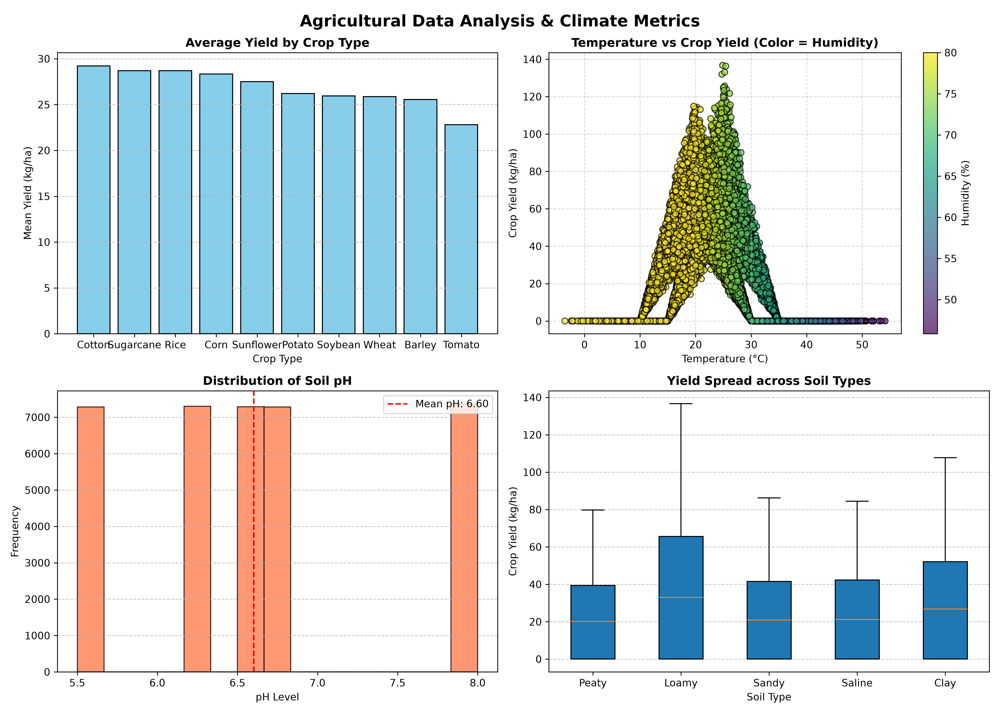
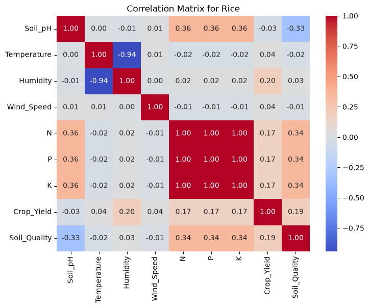
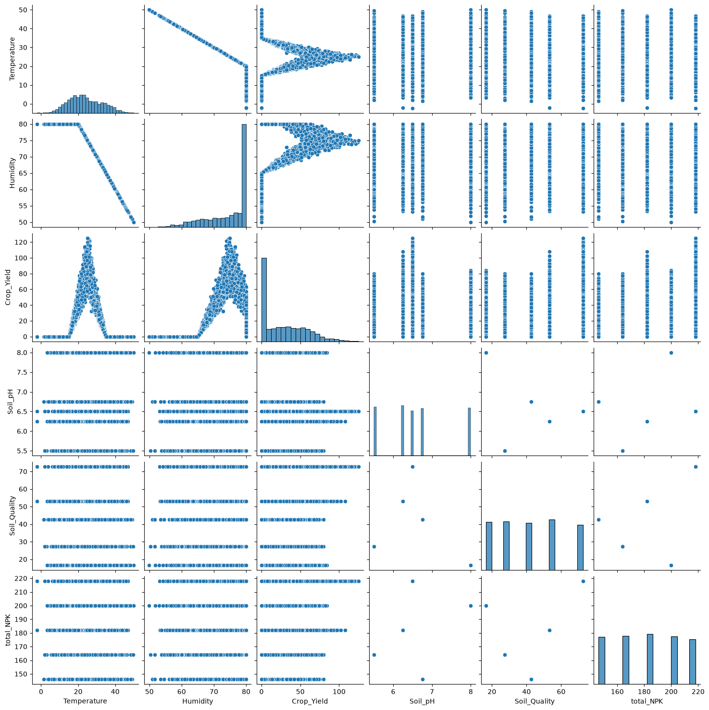

# 📦 𝐰𝐨𝐫𝐤𝐢𝐧𝐠_𝐰𝐢𝐭𝐡_𝐩𝐲𝐭𝐡𝐨𝐧_𝐥𝐢𝐛𝐫𝐚𝐫𝐢𝐞𝐬

Working with Python Libraries: Pandas, NumPy & Matplotlib Analytics

This repository contains Python scripts and datasets demonstrating data analysis, mathematical vectorization, and data visualization using core Python libraries.

---

### 📜 Repository Contents

* pandas_script(crop_production).py : Script that loads, cleans, and processes crop production datasets using Pandas.
* crop_production.csv : Primary dataset containing historical crop yield and production records.
* precision_agriculture_analytics.py : Analytics pipeline performing crop yield filtering, soil metrics evaluation, and CSV summary export.
* crop_yield_dataset.csv : Environmental dataset containing soil parameters, temperature, humidity, NPK metrics, and crop yields.
* 03_crop_data_visualization.py : Visualization script generating statistical charts and multi-panel figures using Matplotlib.
* crop_yield_visualizations.png : Exported 2x2 statistical plot panel.
* README.md : Project documentation and workflow details.

---

## 📂 Project 1: Basic Crop Production Analysis (Pandas)

A foundational data analysis script designed to load, clean, and process historical crop production datasets using Pandas.

Key Features:
* Dataset loading and structural cleanup.
* Filtering and grouping crop production data.

---

## 📂 Project 2: Precision Agriculture & Yield Analytics (Pandas + NumPy)

A data analysis tool built with Pandas and NumPy to evaluate agricultural soil metrics, climate factors, and crop yield performance.

Key Features:
* Dynamic Crop Filtering: Search and filter dataset records based on user input.
* Yield Sorting: Sort crop records by production yield in descending order.
* Vectorized Math: Calculate maximum, minimum, and mean performance metrics using NumPy functions.
* Performance Benchmark: Categorize high-yielding crops relative to mean yield averages.
* Automated CSV Reports: Export structured analytics summaries directly to dynamic CSV files.

---

## 📂 Project 3: Agricultural Data Visualization (Matplotlib)

A visualization pipeline built using Matplotlib to create multi-panel statistical plots that reveal environmental relationships, yield spreads, and distribution trends.

Key Features:
* Multi-Panel Grid Layout: Utilizes a 2x2 subplot layout to compare four analytical charts simultaneously.
* Bar Chart: Evaluates average yield across top crop categories.
* Multidimensional Scatter Plot: Maps temperature against crop yield with a colorbar overlay for humidity.
* Histogram Analysis: Displays soil pH distribution with an explicit mean reference line.
* Boxplot Statistical Analysis: Visualizes the median, interquartile range (IQR middle 50%), and maximum yield potential across soil types.

### Statistical Output Preview

---

## 📂 Project 4: Seaborn Crop Correlation & Visual Analytics

An interactive data analysis pipeline built with Python, Pandas, and Seaborn. This tool allows users to analyze agricultural metrics (such as Temperature, Humidity, Soil pH, and NPK levels) and uncover key variable correlations for any specific crop in the dataset.

---

### 🚀 Features

* **Interactive Crop Filtering**: Dynamically analyzes dataset metrics based on user input with built-in validation loops.
* **Correlation Heatmap**: Generates a custom Seaborn heatmap illustrating positive, negative, and neutral relationships between soil and environmental variables.
* **Pairwise Visual Analytics**: Produces pair plots to visualize scatter distributions and key metric density across soil quality and crop yields.
* **Automated Asset Export**: Exports high-resolution visualizations directly to disk using `bbox_inches='tight'` to eliminate whitespace clipping.

---

### 🛠️ Tech Stack & Libraries

* **Python 3.x**
* **Pandas** — Data manipulation and feature engineering (`total_NPK`)
* **Seaborn** — High-level statistical data visualization (`heatmap`, `pairplot`)
* **Matplotlib** — Plot customization and figure export (`pyplot`)

---

### 📸 Key Output Visualizations

#### 1. Correlation Heatmap
Visualizes multi-variable linear correlations for the selected crop on a scale from `-1.00` to `+1.00`.

#### 2. Pairwise Feature Distribution Plot
Displays bivariate scatter plots and univariate histograms across selected environmental factors.

---

🚀 Getting Started

Prerequisites

Ensure you have Python, Pandas, NumPy, and Matplotlib installed:

pip install pandas numpy matplotlib

Running the Projects

1. Basic Pandas Script:
   python pandas_script(crop_production).py

2. Precision Agriculture Script:
   python precision_agriculture_analytics.py

3. Data Visualization Script:
   python 03_crop_data_visualization.py

---

🤖 AI Collaboration Disclosure

Projects within this repository utilize AI tools as modern software development companions for code optimization, layout debugging, and library implementation learning.
mentation learning.
